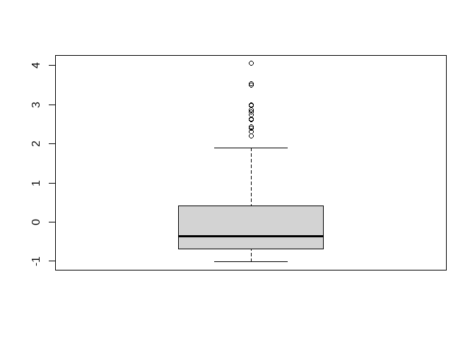

Práctica 02
================

# 2 Hands On: Data Quality and Pre-Processing

## 1. Assessing Data Quality

### Load the following packages: dplyr, na.tools, tidyimpute (version from github decisionpatterns/tidyimpute”)

``` r
library(na.tools)
library(devtools)
```

    ## Loading required package: usethis

``` r
library(dplyr)
```

    ## 
    ## Attaching package: 'dplyr'

    ## The following objects are masked from 'package:stats':
    ## 
    ##     filter, lag

    ## The following objects are masked from 'package:base':
    ## 
    ##     intersect, setdiff, setequal, union

``` r
library(tidyverse)
```

    ## ── Attaching core tidyverse packages ──────────────────────── tidyverse 2.0.0 ──
    ## ✔ forcats   1.0.0     ✔ readr     2.1.4
    ## ✔ ggplot2   3.4.2     ✔ stringr   1.5.0
    ## ✔ lubridate 1.9.2     ✔ tibble    3.2.1
    ## ✔ purrr     1.0.1     ✔ tidyr     1.3.0

    ## ── Conflicts ────────────────────────────────────────── tidyverse_conflicts() ──
    ## ✖ dplyr::filter() masks stats::filter()
    ## ✖ dplyr::lag()    masks stats::lag()
    ## ℹ Use the conflicted package (<http://conflicted.r-lib.org/>) to force all conflicts to become errors

``` r
library(tidyimpute)
library(sos)
```

    ## Loading required package: brew
    ## 
    ## Attaching package: 'sos'
    ## 
    ## The following object is masked from 'package:tidyr':
    ## 
    ##     matches
    ## 
    ## The following object is masked from 'package:dplyr':
    ## 
    ##     matches
    ## 
    ## The following object is masked from 'package:utils':
    ## 
    ##     ?

### Load the carInsurance data set about the insurance risk rating of cars based on several characteristics of each car

``` r
#lee archivo csv, se indica que no contiene fila de encabezado
data <- read.csv('../data/02_data/carInsurance.data', header=FALSE)

#reemplaza valores ? por NA
data[data == "?"] <- NA

#crea un dataframe llamado carInsurance
#se usa el objeto data como argumento para la funcion data.frame()
carInsurance <- data.frame(data)

# vector de nombres de encabezado para el dataframe
header <- c("symboling","normalizedLosses","make","fuelType","aspiration","nDoors","bodyStyle","driveWheels","engineLocation","wheelBase","length","width","height","curbWeight","engineType","nCylinders","engineSize","fuelSystem","bore","stroke","compression-ratio","horsepower","peakRpm","cityMpg","highwayMpg","price")

# Establecer el encabezado al dataframe
names(carInsurance) <- header

#imprimir el dataframe, solo 10 filas
head(carInsurance,10)
```

    ##    symboling normalizedLosses        make fuelType aspiration nDoors
    ## 1          3             <NA> alfa-romero      gas        std    two
    ## 2          3             <NA> alfa-romero      gas        std    two
    ## 3          1             <NA> alfa-romero      gas        std    two
    ## 4          2              164        audi      gas        std   four
    ## 5          2              164        audi      gas        std   four
    ## 6          2             <NA>        audi      gas        std    two
    ## 7          1              158        audi      gas        std   four
    ## 8          1             <NA>        audi      gas        std   four
    ## 9          1              158        audi      gas      turbo   four
    ## 10         0             <NA>        audi      gas      turbo    two
    ##      bodyStyle driveWheels engineLocation wheelBase length width height
    ## 1  convertible         rwd          front      88.6  168.8  64.1   48.8
    ## 2  convertible         rwd          front      88.6  168.8  64.1   48.8
    ## 3    hatchback         rwd          front      94.5  171.2  65.5   52.4
    ## 4        sedan         fwd          front      99.8  176.6  66.2   54.3
    ## 5        sedan         4wd          front      99.4  176.6  66.4   54.3
    ## 6        sedan         fwd          front      99.8  177.3  66.3   53.1
    ## 7        sedan         fwd          front     105.8  192.7  71.4   55.7
    ## 8        wagon         fwd          front     105.8  192.7  71.4   55.7
    ## 9        sedan         fwd          front     105.8  192.7  71.4   55.9
    ## 10   hatchback         4wd          front      99.5  178.2  67.9   52.0
    ##    curbWeight engineType nCylinders engineSize fuelSystem bore stroke
    ## 1        2548       dohc       four        130       mpfi 3.47   2.68
    ## 2        2548       dohc       four        130       mpfi 3.47   2.68
    ## 3        2823       ohcv        six        152       mpfi 2.68   3.47
    ## 4        2337        ohc       four        109       mpfi 3.19   3.40
    ## 5        2824        ohc       five        136       mpfi 3.19   3.40
    ## 6        2507        ohc       five        136       mpfi 3.19   3.40
    ## 7        2844        ohc       five        136       mpfi 3.19   3.40
    ## 8        2954        ohc       five        136       mpfi 3.19   3.40
    ## 9        3086        ohc       five        131       mpfi 3.13   3.40
    ## 10       3053        ohc       five        131       mpfi 3.13   3.40
    ##    compression-ratio horsepower peakRpm cityMpg highwayMpg price
    ## 1                9.0        111    5000      21         27 13495
    ## 2                9.0        111    5000      21         27 16500
    ## 3                9.0        154    5000      19         26 16500
    ## 4               10.0        102    5500      24         30 13950
    ## 5                8.0        115    5500      18         22 17450
    ## 6                8.5        110    5500      19         25 15250
    ## 7                8.5        110    5500      19         25 17710
    ## 8                8.5        110    5500      19         25 18920
    ## 9                8.3        140    5500      17         20 23875
    ## 10               7.0        160    5500      16         22  <NA>

### (a) Check if there are any missing values.

``` r
columnas_valores_faltantes <- colSums(is.na(carInsurance))>0
#head(columnas_valores_faltantes,10)
nombres_columnas_valores_faltantes <- names(columnas_valores_faltantes[columnas_valores_faltantes])
nombres_columnas_valores_faltantes
```

    ## [1] "normalizedLosses" "nDoors"           "bore"             "stroke"          
    ## [5] "horsepower"       "peakRpm"          "price"

``` r
valores_faltantes <- any_na(carInsurance)

#valores_faltantes

if (valores_faltantes) {
  print("Faltan valores en el conjunto de datos.")
} else {
  print("No hay valores faltantes en el conjunto de datos.")
}
```

    ## [1] "Faltan valores en el conjunto de datos."

### (b) Count the number of cases that have, at least, one missing value

``` r
num_valores_faltantes <- carInsurance %>%
  filter_any_na() %>%
  count()
typeof(num_valores_faltantes)
```

    ## [1] "list"

``` r
print(num_valores_faltantes)
```

    ##     n
    ## 1 159

### (c) Create a new data set by removing all the cases that have missing values.

``` r
#head(carInsurance,10)
#count(carInsurance)
carInsurance_sin_NA <- drop_rows_any_na(carInsurance)
head(carInsurance_sin_NA,10)
```

    ##    symboling normalizedLosses      make fuelType aspiration nDoors bodyStyle
    ## 4          2              164      audi      gas        std   four     sedan
    ## 5          2              164      audi      gas        std   four     sedan
    ## 7          1              158      audi      gas        std   four     sedan
    ## 9          1              158      audi      gas      turbo   four     sedan
    ## 11         2              192       bmw      gas        std    two     sedan
    ## 12         0              192       bmw      gas        std   four     sedan
    ## 13         0              188       bmw      gas        std    two     sedan
    ## 14         0              188       bmw      gas        std   four     sedan
    ## 19         2              121 chevrolet      gas        std    two hatchback
    ## 20         1               98 chevrolet      gas        std    two hatchback
    ##    driveWheels engineLocation wheelBase length width height curbWeight
    ## 4          fwd          front      99.8  176.6  66.2   54.3       2337
    ## 5          4wd          front      99.4  176.6  66.4   54.3       2824
    ## 7          fwd          front     105.8  192.7  71.4   55.7       2844
    ## 9          fwd          front     105.8  192.7  71.4   55.9       3086
    ## 11         rwd          front     101.2  176.8  64.8   54.3       2395
    ## 12         rwd          front     101.2  176.8  64.8   54.3       2395
    ## 13         rwd          front     101.2  176.8  64.8   54.3       2710
    ## 14         rwd          front     101.2  176.8  64.8   54.3       2765
    ## 19         fwd          front      88.4  141.1  60.3   53.2       1488
    ## 20         fwd          front      94.5  155.9  63.6   52.0       1874
    ##    engineType nCylinders engineSize fuelSystem bore stroke compression-ratio
    ## 4         ohc       four        109       mpfi 3.19   3.40              10.0
    ## 5         ohc       five        136       mpfi 3.19   3.40               8.0
    ## 7         ohc       five        136       mpfi 3.19   3.40               8.5
    ## 9         ohc       five        131       mpfi 3.13   3.40               8.3
    ## 11        ohc       four        108       mpfi 3.50   2.80               8.8
    ## 12        ohc       four        108       mpfi 3.50   2.80               8.8
    ## 13        ohc        six        164       mpfi 3.31   3.19               9.0
    ## 14        ohc        six        164       mpfi 3.31   3.19               9.0
    ## 19          l      three         61       2bbl 2.91   3.03               9.5
    ## 20        ohc       four         90       2bbl 3.03   3.11               9.6
    ##    horsepower peakRpm cityMpg highwayMpg price
    ## 4         102    5500      24         30 13950
    ## 5         115    5500      18         22 17450
    ## 7         110    5500      19         25 17710
    ## 9         140    5500      17         20 23875
    ## 11        101    5800      23         29 16430
    ## 12        101    5800      23         29 16925
    ## 13        121    4250      21         28 20970
    ## 14        121    4250      21         28 21105
    ## 19         48    5100      47         53  5151
    ## 20         70    5400      38         43  6295

``` r
#count(carInsurance_sin_NA)
```

### (d) Create a new data set by imputing all the missing values with 0.

``` r
# Crear una copia del conjunto de datos original y reemplaza los valores NA por ceros, se aplica a todo el conjunto de datos
newCarInsurance <- carInsurance %>% impute_zero_all()

# Reemplazar los valores NA por ceros en todas las columnas
#newCarInsurance <- impute_zero_all(newCarInsurance)

head(newCarInsurance, 10)
```

    ##    symboling normalizedLosses        make fuelType aspiration nDoors
    ## 1          3                0 alfa-romero      gas        std    two
    ## 2          3                0 alfa-romero      gas        std    two
    ## 3          1                0 alfa-romero      gas        std    two
    ## 4          2              164        audi      gas        std   four
    ## 5          2              164        audi      gas        std   four
    ## 6          2                0        audi      gas        std    two
    ## 7          1              158        audi      gas        std   four
    ## 8          1                0        audi      gas        std   four
    ## 9          1              158        audi      gas      turbo   four
    ## 10         0                0        audi      gas      turbo    two
    ##      bodyStyle driveWheels engineLocation wheelBase length width height
    ## 1  convertible         rwd          front      88.6  168.8  64.1   48.8
    ## 2  convertible         rwd          front      88.6  168.8  64.1   48.8
    ## 3    hatchback         rwd          front      94.5  171.2  65.5   52.4
    ## 4        sedan         fwd          front      99.8  176.6  66.2   54.3
    ## 5        sedan         4wd          front      99.4  176.6  66.4   54.3
    ## 6        sedan         fwd          front      99.8  177.3  66.3   53.1
    ## 7        sedan         fwd          front     105.8  192.7  71.4   55.7
    ## 8        wagon         fwd          front     105.8  192.7  71.4   55.7
    ## 9        sedan         fwd          front     105.8  192.7  71.4   55.9
    ## 10   hatchback         4wd          front      99.5  178.2  67.9   52.0
    ##    curbWeight engineType nCylinders engineSize fuelSystem bore stroke
    ## 1        2548       dohc       four        130       mpfi 3.47   2.68
    ## 2        2548       dohc       four        130       mpfi 3.47   2.68
    ## 3        2823       ohcv        six        152       mpfi 2.68   3.47
    ## 4        2337        ohc       four        109       mpfi 3.19   3.40
    ## 5        2824        ohc       five        136       mpfi 3.19   3.40
    ## 6        2507        ohc       five        136       mpfi 3.19   3.40
    ## 7        2844        ohc       five        136       mpfi 3.19   3.40
    ## 8        2954        ohc       five        136       mpfi 3.19   3.40
    ## 9        3086        ohc       five        131       mpfi 3.13   3.40
    ## 10       3053        ohc       five        131       mpfi 3.13   3.40
    ##    compression-ratio horsepower peakRpm cityMpg highwayMpg price
    ## 1                9.0        111    5000      21         27 13495
    ## 2                9.0        111    5000      21         27 16500
    ## 3                9.0        154    5000      19         26 16500
    ## 4               10.0        102    5500      24         30 13950
    ## 5                8.0        115    5500      18         22 17450
    ## 6                8.5        110    5500      19         25 15250
    ## 7                8.5        110    5500      19         25 17710
    ## 8                8.5        110    5500      19         25 18920
    ## 9                8.3        140    5500      17         20 23875
    ## 10               7.0        160    5500      16         22     0

``` r
#count(newCarInsurance)
```

### (e) Create a new data set by imputing the mean in all the columns which have double type values.

``` r
#ls("package:tidyimpute")
#head(carInsurance,10)
newCarInsurance <- carInsurance 
#newCarInsurance

# Identificar columnas con valores de tipo double
columnas_double <- sapply(carInsurance, is.double)
#columnas_double
nombres_columnas_double <- names(columnas_double[columnas_double])
#nombres_columnas_double
#typeof(nombres_columnas_double)

# Calcular la media de cada columna
media <- colMeans(carInsurance[,nombres_columnas_double])
media
```

    ##         wheelBase            length             width            height 
    ##          98.75659         174.04927          65.90780          53.72488 
    ## compression-ratio 
    ##          10.14254

``` r
# Crear un nuevo conjunto de datos imputando la media en las columnas correspondientes
nuevo_data <- carInsurance

#for (col in nombres_columnas_double) {
#  nuevo_data[[col]] <- ifelse(is.na(nuevo_data[[col]]), media[col], nuevo_data[[col]])
#}

#for (col in nombres_columnas_double) {
#  newCarInsurance[[col]][is.na(newCarInsurance[[col]])] <- media[col]
#}
for (col in nombres_columnas_double) {
  nuevo_data[[col]] <- media[col]
}
head(nuevo_data, 10)
```

    ##    symboling normalizedLosses        make fuelType aspiration nDoors
    ## 1          3             <NA> alfa-romero      gas        std    two
    ## 2          3             <NA> alfa-romero      gas        std    two
    ## 3          1             <NA> alfa-romero      gas        std    two
    ## 4          2              164        audi      gas        std   four
    ## 5          2              164        audi      gas        std   four
    ## 6          2             <NA>        audi      gas        std    two
    ## 7          1              158        audi      gas        std   four
    ## 8          1             <NA>        audi      gas        std   four
    ## 9          1              158        audi      gas      turbo   four
    ## 10         0             <NA>        audi      gas      turbo    two
    ##      bodyStyle driveWheels engineLocation wheelBase   length   width   height
    ## 1  convertible         rwd          front  98.75659 174.0493 65.9078 53.72488
    ## 2  convertible         rwd          front  98.75659 174.0493 65.9078 53.72488
    ## 3    hatchback         rwd          front  98.75659 174.0493 65.9078 53.72488
    ## 4        sedan         fwd          front  98.75659 174.0493 65.9078 53.72488
    ## 5        sedan         4wd          front  98.75659 174.0493 65.9078 53.72488
    ## 6        sedan         fwd          front  98.75659 174.0493 65.9078 53.72488
    ## 7        sedan         fwd          front  98.75659 174.0493 65.9078 53.72488
    ## 8        wagon         fwd          front  98.75659 174.0493 65.9078 53.72488
    ## 9        sedan         fwd          front  98.75659 174.0493 65.9078 53.72488
    ## 10   hatchback         4wd          front  98.75659 174.0493 65.9078 53.72488
    ##    curbWeight engineType nCylinders engineSize fuelSystem bore stroke
    ## 1        2548       dohc       four        130       mpfi 3.47   2.68
    ## 2        2548       dohc       four        130       mpfi 3.47   2.68
    ## 3        2823       ohcv        six        152       mpfi 2.68   3.47
    ## 4        2337        ohc       four        109       mpfi 3.19   3.40
    ## 5        2824        ohc       five        136       mpfi 3.19   3.40
    ## 6        2507        ohc       five        136       mpfi 3.19   3.40
    ## 7        2844        ohc       five        136       mpfi 3.19   3.40
    ## 8        2954        ohc       five        136       mpfi 3.19   3.40
    ## 9        3086        ohc       five        131       mpfi 3.13   3.40
    ## 10       3053        ohc       five        131       mpfi 3.13   3.40
    ##    compression-ratio horsepower peakRpm cityMpg highwayMpg price
    ## 1           10.14254        111    5000      21         27 13495
    ## 2           10.14254        111    5000      21         27 16500
    ## 3           10.14254        154    5000      19         26 16500
    ## 4           10.14254        102    5500      24         30 13950
    ## 5           10.14254        115    5500      18         22 17450
    ## 6           10.14254        110    5500      19         25 15250
    ## 7           10.14254        110    5500      19         25 17710
    ## 8           10.14254        110    5500      19         25 18920
    ## 9           10.14254        140    5500      17         20 23875
    ## 10          10.14254        160    5500      16         22  <NA>

### (f) Create a new data set by imputing the mode in all the columns which have integer type values.

``` r
# Cargar el paquete necesario
library(modeest)
```

    ## Warning: package 'modeest' was built under R version 4.3.1

``` r
newCarInsurance2 <- carInsurance 
columnas_integer <- sapply(carInsurance, is.integer)
columnas_integer
```

    ##         symboling  normalizedLosses              make          fuelType 
    ##              TRUE             FALSE             FALSE             FALSE 
    ##        aspiration            nDoors         bodyStyle       driveWheels 
    ##             FALSE             FALSE             FALSE             FALSE 
    ##    engineLocation         wheelBase            length             width 
    ##             FALSE             FALSE             FALSE             FALSE 
    ##            height        curbWeight        engineType        nCylinders 
    ##             FALSE              TRUE             FALSE             FALSE 
    ##        engineSize        fuelSystem              bore            stroke 
    ##              TRUE             FALSE             FALSE             FALSE 
    ## compression-ratio        horsepower           peakRpm           cityMpg 
    ##             FALSE             FALSE             FALSE              TRUE 
    ##        highwayMpg             price 
    ##              TRUE             FALSE

``` r
nombres_columnas_integer <- names(columnas_integer[columnas_integer])
nombres_columnas_integer
```

    ## [1] "symboling"  "curbWeight" "engineSize" "cityMpg"    "highwayMpg"

``` r
# Crear una función personalizada para calcular la moda de un vector
moda_personalizada <- function(x) {
  moda <- unique(x)[which.max(tabulate(match(x, unique(x))))]
  if (length(moda) == 0) {  # Si no hay moda, devolver NA
    return(NA)
  } else {
    return(moda)
  }
}

# Calcular la moda en las columnas de tipo double
moda <- sapply(carInsurance[, nombres_columnas_integer], moda_personalizada)

# Resultado: vector con las modas de cada columna
moda
```

    ##  symboling curbWeight engineSize    cityMpg highwayMpg 
    ##          0       2385        122         31         25

``` r
# Crear un nuevo conjunto de datos imputando la media en las columnas correspondientes
nuevo_data_moda <- carInsurance
head(nuevo_data_moda, 10)
```

    ##    symboling normalizedLosses        make fuelType aspiration nDoors
    ## 1          3             <NA> alfa-romero      gas        std    two
    ## 2          3             <NA> alfa-romero      gas        std    two
    ## 3          1             <NA> alfa-romero      gas        std    two
    ## 4          2              164        audi      gas        std   four
    ## 5          2              164        audi      gas        std   four
    ## 6          2             <NA>        audi      gas        std    two
    ## 7          1              158        audi      gas        std   four
    ## 8          1             <NA>        audi      gas        std   four
    ## 9          1              158        audi      gas      turbo   four
    ## 10         0             <NA>        audi      gas      turbo    two
    ##      bodyStyle driveWheels engineLocation wheelBase length width height
    ## 1  convertible         rwd          front      88.6  168.8  64.1   48.8
    ## 2  convertible         rwd          front      88.6  168.8  64.1   48.8
    ## 3    hatchback         rwd          front      94.5  171.2  65.5   52.4
    ## 4        sedan         fwd          front      99.8  176.6  66.2   54.3
    ## 5        sedan         4wd          front      99.4  176.6  66.4   54.3
    ## 6        sedan         fwd          front      99.8  177.3  66.3   53.1
    ## 7        sedan         fwd          front     105.8  192.7  71.4   55.7
    ## 8        wagon         fwd          front     105.8  192.7  71.4   55.7
    ## 9        sedan         fwd          front     105.8  192.7  71.4   55.9
    ## 10   hatchback         4wd          front      99.5  178.2  67.9   52.0
    ##    curbWeight engineType nCylinders engineSize fuelSystem bore stroke
    ## 1        2548       dohc       four        130       mpfi 3.47   2.68
    ## 2        2548       dohc       four        130       mpfi 3.47   2.68
    ## 3        2823       ohcv        six        152       mpfi 2.68   3.47
    ## 4        2337        ohc       four        109       mpfi 3.19   3.40
    ## 5        2824        ohc       five        136       mpfi 3.19   3.40
    ## 6        2507        ohc       five        136       mpfi 3.19   3.40
    ## 7        2844        ohc       five        136       mpfi 3.19   3.40
    ## 8        2954        ohc       five        136       mpfi 3.19   3.40
    ## 9        3086        ohc       five        131       mpfi 3.13   3.40
    ## 10       3053        ohc       five        131       mpfi 3.13   3.40
    ##    compression-ratio horsepower peakRpm cityMpg highwayMpg price
    ## 1                9.0        111    5000      21         27 13495
    ## 2                9.0        111    5000      21         27 16500
    ## 3                9.0        154    5000      19         26 16500
    ## 4               10.0        102    5500      24         30 13950
    ## 5                8.0        115    5500      18         22 17450
    ## 6                8.5        110    5500      19         25 15250
    ## 7                8.5        110    5500      19         25 17710
    ## 8                8.5        110    5500      19         25 18920
    ## 9                8.3        140    5500      17         20 23875
    ## 10               7.0        160    5500      16         22  <NA>

``` r
for (col in nombres_columnas_integer) {
  nuevo_data_moda[[col]] <- moda[col]
}
head(nuevo_data_moda, 10)
```

    ##    symboling normalizedLosses        make fuelType aspiration nDoors
    ## 1          0             <NA> alfa-romero      gas        std    two
    ## 2          0             <NA> alfa-romero      gas        std    two
    ## 3          0             <NA> alfa-romero      gas        std    two
    ## 4          0              164        audi      gas        std   four
    ## 5          0              164        audi      gas        std   four
    ## 6          0             <NA>        audi      gas        std    two
    ## 7          0              158        audi      gas        std   four
    ## 8          0             <NA>        audi      gas        std   four
    ## 9          0              158        audi      gas      turbo   four
    ## 10         0             <NA>        audi      gas      turbo    two
    ##      bodyStyle driveWheels engineLocation wheelBase length width height
    ## 1  convertible         rwd          front      88.6  168.8  64.1   48.8
    ## 2  convertible         rwd          front      88.6  168.8  64.1   48.8
    ## 3    hatchback         rwd          front      94.5  171.2  65.5   52.4
    ## 4        sedan         fwd          front      99.8  176.6  66.2   54.3
    ## 5        sedan         4wd          front      99.4  176.6  66.4   54.3
    ## 6        sedan         fwd          front      99.8  177.3  66.3   53.1
    ## 7        sedan         fwd          front     105.8  192.7  71.4   55.7
    ## 8        wagon         fwd          front     105.8  192.7  71.4   55.7
    ## 9        sedan         fwd          front     105.8  192.7  71.4   55.9
    ## 10   hatchback         4wd          front      99.5  178.2  67.9   52.0
    ##    curbWeight engineType nCylinders engineSize fuelSystem bore stroke
    ## 1        2385       dohc       four        122       mpfi 3.47   2.68
    ## 2        2385       dohc       four        122       mpfi 3.47   2.68
    ## 3        2385       ohcv        six        122       mpfi 2.68   3.47
    ## 4        2385        ohc       four        122       mpfi 3.19   3.40
    ## 5        2385        ohc       five        122       mpfi 3.19   3.40
    ## 6        2385        ohc       five        122       mpfi 3.19   3.40
    ## 7        2385        ohc       five        122       mpfi 3.19   3.40
    ## 8        2385        ohc       five        122       mpfi 3.19   3.40
    ## 9        2385        ohc       five        122       mpfi 3.13   3.40
    ## 10       2385        ohc       five        122       mpfi 3.13   3.40
    ##    compression-ratio horsepower peakRpm cityMpg highwayMpg price
    ## 1                9.0        111    5000      31         25 13495
    ## 2                9.0        111    5000      31         25 16500
    ## 3                9.0        154    5000      31         25 16500
    ## 4               10.0        102    5500      31         25 13950
    ## 5                8.0        115    5500      31         25 17450
    ## 6                8.5        110    5500      31         25 15250
    ## 7                8.5        110    5500      31         25 17710
    ## 8                8.5        110    5500      31         25 18920
    ## 9                8.3        140    5500      31         25 23875
    ## 10               7.0        160    5500      31         25  <NA>

### (g) Create a new data set by imputing the most frequent value to the column ”nDoors”.

### Tip: use the function impute_replace()

``` r
# Crear un nuevo conjunto de datos
newCarInsurance2 <- carInsurance

# Obtener el valor más frecuente en la columna "nDoors"
valorMasFrecuente <- names(which.max(table(newCarInsurance2$nDoors)))
valorMasFrecuente
```

    ## [1] "four"

``` r
# Imputar el valor más frecuente en la columna "nDoors"
newCarInsurance2$nDoors[is.na(newCarInsurance2$nDoors)] <- valorMasFrecuente

# Verificar el resultado
head(newCarInsurance2)
```

    ##   symboling normalizedLosses        make fuelType aspiration nDoors   bodyStyle
    ## 1         3             <NA> alfa-romero      gas        std    two convertible
    ## 2         3             <NA> alfa-romero      gas        std    two convertible
    ## 3         1             <NA> alfa-romero      gas        std    two   hatchback
    ## 4         2              164        audi      gas        std   four       sedan
    ## 5         2              164        audi      gas        std   four       sedan
    ## 6         2             <NA>        audi      gas        std    two       sedan
    ##   driveWheels engineLocation wheelBase length width height curbWeight
    ## 1         rwd          front      88.6  168.8  64.1   48.8       2548
    ## 2         rwd          front      88.6  168.8  64.1   48.8       2548
    ## 3         rwd          front      94.5  171.2  65.5   52.4       2823
    ## 4         fwd          front      99.8  176.6  66.2   54.3       2337
    ## 5         4wd          front      99.4  176.6  66.4   54.3       2824
    ## 6         fwd          front      99.8  177.3  66.3   53.1       2507
    ##   engineType nCylinders engineSize fuelSystem bore stroke compression-ratio
    ## 1       dohc       four        130       mpfi 3.47   2.68               9.0
    ## 2       dohc       four        130       mpfi 3.47   2.68               9.0
    ## 3       ohcv        six        152       mpfi 2.68   3.47               9.0
    ## 4        ohc       four        109       mpfi 3.19   3.40              10.0
    ## 5        ohc       five        136       mpfi 3.19   3.40               8.0
    ## 6        ohc       five        136       mpfi 3.19   3.40               8.5
    ##   horsepower peakRpm cityMpg highwayMpg price
    ## 1        111    5000      21         27 13495
    ## 2        111    5000      21         27 16500
    ## 3        154    5000      19         26 16500
    ## 4        102    5500      24         30 13950
    ## 5        115    5500      18         22 17450
    ## 6        110    5500      19         25 15250

``` r
# Imputar el valor más frecuente en la columna "nDoors"
newCarInsurance2$nDoors <- valorMasFrecuente

# Verificar el resultado
head(newCarInsurance2)
```

    ##   symboling normalizedLosses        make fuelType aspiration nDoors   bodyStyle
    ## 1         3             <NA> alfa-romero      gas        std   four convertible
    ## 2         3             <NA> alfa-romero      gas        std   four convertible
    ## 3         1             <NA> alfa-romero      gas        std   four   hatchback
    ## 4         2              164        audi      gas        std   four       sedan
    ## 5         2              164        audi      gas        std   four       sedan
    ## 6         2             <NA>        audi      gas        std   four       sedan
    ##   driveWheels engineLocation wheelBase length width height curbWeight
    ## 1         rwd          front      88.6  168.8  64.1   48.8       2548
    ## 2         rwd          front      88.6  168.8  64.1   48.8       2548
    ## 3         rwd          front      94.5  171.2  65.5   52.4       2823
    ## 4         fwd          front      99.8  176.6  66.2   54.3       2337
    ## 5         4wd          front      99.4  176.6  66.4   54.3       2824
    ## 6         fwd          front      99.8  177.3  66.3   53.1       2507
    ##   engineType nCylinders engineSize fuelSystem bore stroke compression-ratio
    ## 1       dohc       four        130       mpfi 3.47   2.68               9.0
    ## 2       dohc       four        130       mpfi 3.47   2.68               9.0
    ## 3       ohcv        six        152       mpfi 2.68   3.47               9.0
    ## 4        ohc       four        109       mpfi 3.19   3.40              10.0
    ## 5        ohc       five        136       mpfi 3.19   3.40               8.0
    ## 6        ohc       five        136       mpfi 3.19   3.40               8.5
    ##   horsepower peakRpm cityMpg highwayMpg price
    ## 1        111    5000      21         27 13495
    ## 2        111    5000      21         27 16500
    ## 3        154    5000      19         26 16500
    ## 4        102    5500      24         30 13950
    ## 5        115    5500      18         22 17450
    ## 6        110    5500      19         25 15250

### (h) Combine the three last imputations to obtain a final dataset. Are there any duplicated cases?

### Tip: use the functions distinct() and count()

``` r
# Crear un nuevo conjunto de datos imputando la media en las columnas correspondientes
newCarInsuranceFInal <- carInsurance
# Identificar columnas con valores de tipo double
columnas_double <- sapply(carInsurance, is.double)
#columnas_double
nombres_columnas_double <- names(columnas_double[columnas_double])
#nombres_columnas_double

# Calcular la media de cada columna
media <- colMeans(carInsurance[,nombres_columnas_double])
#media

for (col in nombres_columnas_double) {
  newCarInsuranceFInal[[col]] <- media[col]
}
#head(newCarInsuranceFInal)

columnas_integer <- sapply(carInsurance, is.integer)
#columnas_integer
nombres_columnas_integer <- names(columnas_integer[columnas_integer])
#nombres_columnas_integer


# Crear una función personalizada para calcular la moda de un vector
moda_personalizada <- function(x) {
  moda <- unique(x)[which.max(tabulate(match(x, unique(x))))]
  if (length(moda) == 0) {  # Si no hay moda, devolver NA
    return(NA)
  } else {
    return(moda)
  }
}

# Calcular la moda en las columnas de tipo double
moda <- sapply(carInsurance[, nombres_columnas_integer], moda_personalizada)

# Resultado: vector con las modas de cada columna
#moda

for (col in nombres_columnas_integer) {
  newCarInsuranceFInal[[col]] <- moda[col]
}
#head(newCarInsuranceFInal)


# Obtener el valor más frecuente en la columna "nDoors"
valorMasFrecuente <- names(which.max(table(newCarInsuranceFInal$nDoors)))
#valorMasFrecuente

# Imputar el valor más frecuente en la columna "nDoors"
newCarInsuranceFInal$nDoors[is.na(newCarInsuranceFInal$nDoors)] <- valorMasFrecuente

# Verificar el resultado
#head(newCarInsuranceFInal)

# Imputar el valor más frecuente en la columna "nDoors"
newCarInsuranceFInal$nDoors <- valorMasFrecuente

# Verificar el resultado
head(newCarInsuranceFInal)
```

    ##   symboling normalizedLosses        make fuelType aspiration nDoors   bodyStyle
    ## 1         0             <NA> alfa-romero      gas        std   four convertible
    ## 2         0             <NA> alfa-romero      gas        std   four convertible
    ## 3         0             <NA> alfa-romero      gas        std   four   hatchback
    ## 4         0              164        audi      gas        std   four       sedan
    ## 5         0              164        audi      gas        std   four       sedan
    ## 6         0             <NA>        audi      gas        std   four       sedan
    ##   driveWheels engineLocation wheelBase   length   width   height curbWeight
    ## 1         rwd          front  98.75659 174.0493 65.9078 53.72488       2385
    ## 2         rwd          front  98.75659 174.0493 65.9078 53.72488       2385
    ## 3         rwd          front  98.75659 174.0493 65.9078 53.72488       2385
    ## 4         fwd          front  98.75659 174.0493 65.9078 53.72488       2385
    ## 5         4wd          front  98.75659 174.0493 65.9078 53.72488       2385
    ## 6         fwd          front  98.75659 174.0493 65.9078 53.72488       2385
    ##   engineType nCylinders engineSize fuelSystem bore stroke compression-ratio
    ## 1       dohc       four        122       mpfi 3.47   2.68          10.14254
    ## 2       dohc       four        122       mpfi 3.47   2.68          10.14254
    ## 3       ohcv        six        122       mpfi 2.68   3.47          10.14254
    ## 4        ohc       four        122       mpfi 3.19   3.40          10.14254
    ## 5        ohc       five        122       mpfi 3.19   3.40          10.14254
    ## 6        ohc       five        122       mpfi 3.19   3.40          10.14254
    ##   horsepower peakRpm cityMpg highwayMpg price
    ## 1        111    5000      31         25 13495
    ## 2        111    5000      31         25 16500
    ## 3        154    5000      31         25 16500
    ## 4        102    5500      31         25 13950
    ## 5        115    5500      31         25 17450
    ## 6        110    5500      31         25 15250

``` r
# Verificar si existen casos duplicados
casosDuplicados <- newCarInsuranceFInal %>%
  distinct() %>%
  count()

# Imprimir el resultado
if (casosDuplicados$n == nrow(newCarInsuranceFInal)) {
  print("No hay casos duplicados en el conjunto de datos.")
} else {
  print("Existen casos duplicados en el conjunto de datos.")
}
```

    ## [1] "Existen casos duplicados en el conjunto de datos."

``` r
# Verificar duplicados por columna
duplicadosPorColumna <- newCarInsuranceFInal %>%
  group_by(across(everything())) %>%
  count() %>%
  filter(n > 1) %>%
  select(-n)

# Imprimir el resultado
if (nrow(duplicadosPorColumna) == 0) {
  print("No hay columnas con duplicados en el conjunto de datos.")
} else {
  print("Columnas con duplicados y su conteo respectivo:")
  print(duplicadosPorColumna)
}
```

    ## [1] "Columnas con duplicados y su conteo respectivo:"
    ## # A tibble: 1 × 26
    ## # Groups:   symboling, normalizedLosses, make, fuelType, aspiration, nDoors,
    ## #   bodyStyle, driveWheels, engineLocation, wheelBase, length, width, height,
    ## #   curbWeight, engineType, nCylinders, engineSize, fuelSystem, bore, stroke,
    ## #   compression-ratio, horsepower, peakRpm, cityMpg, highwayMpg, price [1]
    ##   symboling normalizedLosses make  fuelType aspiration nDoors bodyStyle
    ##       <int> <chr>            <chr> <chr>    <chr>      <chr>  <chr>    
    ## 1         0 <NA>             isuzu gas      std        four   sedan    
    ## # ℹ 19 more variables: driveWheels <chr>, engineLocation <chr>,
    ## #   wheelBase <dbl>, length <dbl>, width <dbl>, height <dbl>, curbWeight <int>,
    ## #   engineType <chr>, nCylinders <chr>, engineSize <int>, fuelSystem <chr>,
    ## #   bore <chr>, stroke <chr>, `compression-ratio` <dbl>, horsepower <chr>,
    ## #   peakRpm <chr>, cityMpg <int>, highwayMpg <int>, price <chr>

## 2. Data Pre-Processing

### 2. Load the package dlookr. Use the same car insurance data set above and apply the following transformations to the price attribute. Be critical regarding the obtained results

``` r
library(dlookr)
```

    ## Warning: package 'dlookr' was built under R version 4.3.1

    ## Registered S3 method overwritten by 'httr':
    ##   method         from  
    ##   print.response rmutil

    ## 
    ## Attaching package: 'dlookr'

    ## The following object is masked from 'package:modeest':
    ## 
    ##     skewness

    ## The following object is masked from 'package:tidyr':
    ## 
    ##     extract

    ## The following object is masked from 'package:base':
    ## 
    ##     transform

### (a) Apply range-based normalization and z-score normalization.

### Tip: use the function transform().

``` r
newCarInsuranceNormalizada <- carInsurance


newCarInsuranceNormalizada <- newCarInsuranceNormalizada %>%
  mutate(price = as.numeric(as.character(price)))

creatinine_minmax <- transform(newCarInsuranceNormalizada$price, method = "zscore")
creatinine_minmax
```

    ##   [1]  0.036223511  0.414350467  0.414350467  0.093477343  0.533891434
    ##   [6]  0.257059720  0.566607910  0.718865352  1.342365873           NA
    ##  [11]  0.405542185  0.467829321  0.976822177  0.993809578  1.429190365
    ##  [16]  2.208723306  3.536886373  2.978818803 -1.013723682 -0.869771191
    ##  [21] -0.834538063 -0.960748158 -0.859452918 -0.660637414 -0.878076142
    ##  [26] -0.819815649 -0.704427157 -0.585012022 -0.539334790 -0.030593598
    ##  [31] -0.846617993 -0.799304936 -0.982517198 -0.840326363 -0.764826804
    ##  [36] -0.743938593 -0.743938593 -0.668439035 -0.517439918 -0.548898067
    ##  [41] -0.366440801 -0.032984417 -0.360149171 -0.808113218           NA
    ##  [46]           NA -0.271688855  2.396213877  2.811461448  2.868086117
    ##  [51] -1.008187048 -0.894937710 -0.806854892 -0.819438152 -0.731355333
    ##  [56] -0.284649612 -0.171400275  0.055098401  0.306763596 -0.548898067
    ##  [61] -0.592939476 -0.328691021 -0.372732431 -0.303524502 -0.246899833
    ##  [66]  0.638332490  0.646385776  1.553387139  1.892631822  1.883571875
    ##  [71]  2.314422688  2.639574120  2.749300145  3.492215800  4.050912533
    ##  [76]  0.414727964 -0.983775524 -0.883109446 -0.822709799 -0.694360550
    ##  [81] -0.408720553 -0.592436146 -0.072747518  0.209117500  0.161301113
    ##  [86] -0.782443368 -0.631444251 -0.494286720 -0.494286720 -0.969933938
    ##  [91] -0.768601782 -0.825226451 -0.800059932 -0.737143633 -0.743435263
    ##  [96] -0.680518964 -0.718268743 -0.655352444 -0.623894295 -0.535811477
    ## [101] -0.460311918  0.036726842  0.149976179  0.036726842  0.502307452
    ## [106]  0.816888946  0.653306569 -0.164479482 -0.000897105 -0.096529879
    ## [111]  0.082152409  0.298584477  0.464683506  0.438887823  0.486704210
    ## [116]  0.430708704  0.596807733  0.621974252 -0.960748158 -0.660637414
    ## [121] -0.878076142 -0.819815649 -0.704427157 -0.539334790 -0.055760118
    ## [126]  1.108694739  2.431195339  2.619944235  2.997442027           NA
    ## [131] -0.492273398 -0.416773840 -0.170771112 -0.130504680  0.230634874
    ## [136]  0.289776195  0.621974252  0.681115573 -1.017876158 -0.774390082
    ## [141] -0.705182153 -0.765204302 -0.683538946 -0.408594721 -0.500075019
    ## [146] -0.245138177 -0.722798717 -0.378646563 -0.653590788 -0.190400997
    ## [151] -0.988934660 -0.864360389 -0.845485499 -0.791377482 -0.668061537
    ## [156] -0.557328851 -0.788860830 -0.756144355 -0.668061537 -0.681903122
    ## [161] -0.688194752 -0.610178542 -0.496929204 -0.647928321 -0.625278454
    ## [166] -0.491895900 -0.461696077 -0.598727776 -0.448986985 -0.404945575
    ## [171] -0.252688133 -0.208646723  0.561448773 -0.535937309 -0.315730264
    ## [176] -0.405071408 -0.290563744 -0.246522335  0.421648757  0.351182503
    ## [181]  0.312426063  0.319976018 -0.683538946 -0.658372427 -0.655855775
    ## [186] -0.630689255 -0.592939476 -0.467106879 -0.404190580 -0.202858424
    ## [191] -0.406078069  0.011056992  0.080264920 -0.115404769 -0.033613580
    ## [196]  0.026156903  0.349546679  0.416237956  0.655949054  0.722640330
    ## [201]  0.457762713  0.734594427  1.041625965  1.165571073  1.185075126
    ## attr(,"method")
    ## [1] "zscore"
    ## attr(,"origin")
    ##   [1] 13495 16500 16500 13950 17450 15250 17710 18920 23875    NA 16430 16925
    ##  [13] 20970 21105 24565 30760 41315 36880  5151  6295  6575  5572  6377  7957
    ##  [25]  6229  6692  7609  8558  8921 12964  6479  6855  5399  6529  7129  7295
    ##  [37]  7295  7895  9095  8845 10295 12945 10345  6785    NA    NA 11048 32250
    ##  [49] 35550 36000  5195  6095  6795  6695  7395 10945 11845 13645 15645  8845
    ##  [61]  8495 10595 10245 10795 11245 18280 18344 25552 28248 28176 31600 34184
    ##  [73] 35056 40960 45400 16503  5389  6189  6669  7689  9959  8499 12629 14869
    ##  [85] 14489  6989  8189  9279  9279  5499  7099  6649  6849  7349  7299  7799
    ##  [97]  7499  7999  8249  8949  9549 13499 14399 13499 17199 19699 18399 11900
    ## [109] 13200 12440 13860 15580 16900 16695 17075 16630 17950 18150  5572  7957
    ## [121]  6229  6692  7609  8921 12764 22018 32528 34028 37028    NA  9295  9895
    ## [133] 11850 12170 15040 15510 18150 18620  5118  7053  7603  7126  7775  9960
    ## [145]  9233 11259  7463 10198  8013 11694  5348  6338  6488  6918  7898  8778
    ## [157]  6938  7198  7898  7788  7738  8358  9258  8058  8238  9298  9538  8449
    ## [169]  9639  9989 11199 11549 17669  8948 10698  9988 10898 11248 16558 15998
    ## [181] 15690 15750  7775  7975  7995  8195  8495  9495  9995 11595  9980 13295
    ## [193] 13845 12290 12940 13415 15985 16515 18420 18950 16845 19045 21485 22470
    ## [205] 22625
    ## attr(,"class")
    ## [1] "transform" "numeric"

``` r
newCarInsuranceNormalizada %>% 
  mutate(price = transform(newCarInsuranceNormalizada$price, method = "zscore")) %>% 
  select(price) %>% 
  boxplot()
```

<!-- -->
