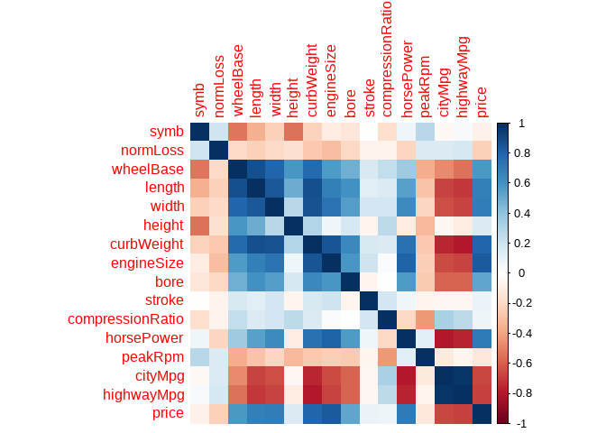
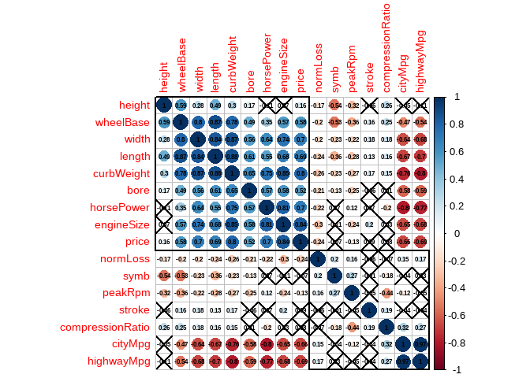

Práctica 02
================

# 2 Hands On: Data Quality and Pre-Processing

## 1. Assessing Data Quality

### Load the following packages: dplyr, na.tools, tidyimpute (version from github decisionpatterns/tidyimpute”)

``` r
library(na.tools)
library(devtools)
```

    ## Loading required package: usethis

``` r
library(dplyr)
```

    ## 
    ## Attaching package: 'dplyr'

    ## The following objects are masked from 'package:stats':
    ## 
    ##     filter, lag

    ## The following objects are masked from 'package:base':
    ## 
    ##     intersect, setdiff, setequal, union

``` r
library(tidyverse)
```

    ## ── Attaching core tidyverse packages ──────────────────────── tidyverse 2.0.0 ──
    ## ✔ forcats   1.0.0     ✔ readr     2.1.4
    ## ✔ ggplot2   3.4.2     ✔ stringr   1.5.0
    ## ✔ lubridate 1.9.2     ✔ tibble    3.2.1
    ## ✔ purrr     1.0.1     ✔ tidyr     1.3.0

    ## ── Conflicts ────────────────────────────────────────── tidyverse_conflicts() ──
    ## ✖ dplyr::filter() masks stats::filter()
    ## ✖ dplyr::lag()    masks stats::lag()
    ## ℹ Use the conflicted package (<http://conflicted.r-lib.org/>) to force all conflicts to become errors

``` r
library(tidyimpute)
library(sos)
```

    ## Loading required package: brew
    ## 
    ## Attaching package: 'sos'
    ## 
    ## The following object is masked from 'package:tidyr':
    ## 
    ##     matches
    ## 
    ## The following object is masked from 'package:dplyr':
    ## 
    ##     matches
    ## 
    ## The following object is masked from 'package:utils':
    ## 
    ##     ?

``` r
library(ggplot2)
```

### Load the carInsurance data set about the insurance risk rating of cars based on several characteristics of each car

``` r
load("../data/02_data/carInsurance.Rdata") 
carIns
```

    ## # A tibble: 205 × 26
    ##     symb normLoss make        fuelType aspiration nDoors bodyStyle   driveWheels
    ##    <int>    <int> <fct>       <fct>    <fct>      <fct>  <fct>       <fct>      
    ##  1     3       NA alfa-romero gas      std        two    convertible rwd        
    ##  2     3       NA alfa-romero gas      std        two    convertible rwd        
    ##  3     1       NA alfa-romero gas      std        two    hatchback   rwd        
    ##  4     2      164 audi        gas      std        four   sedan       fwd        
    ##  5     2      164 audi        gas      std        four   sedan       4wd        
    ##  6     2       NA audi        gas      std        two    sedan       fwd        
    ##  7     1      158 audi        gas      std        four   sedan       fwd        
    ##  8     1       NA audi        gas      std        four   wagon       fwd        
    ##  9     1      158 audi        gas      turbo      four   sedan       fwd        
    ## 10     0       NA audi        gas      turbo      two    hatchback   4wd        
    ## # ℹ 195 more rows
    ## # ℹ 18 more variables: engineLocation <fct>, wheelBase <dbl>, length <dbl>,
    ## #   width <dbl>, height <dbl>, curbWeight <int>, engineType <fct>,
    ## #   nrCylinds <fct>, engineSize <int>, fuelSystem <fct>, bore <dbl>,
    ## #   stroke <dbl>, compressionRatio <dbl>, horsePower <int>, peakRpm <int>,
    ## #   cityMpg <int>, highwayMpg <int>, price <int>

``` r
carInsurance <- carIns
head(carInsurance, 10)
```

    ## # A tibble: 10 × 26
    ##     symb normLoss make        fuelType aspiration nDoors bodyStyle   driveWheels
    ##    <int>    <int> <fct>       <fct>    <fct>      <fct>  <fct>       <fct>      
    ##  1     3       NA alfa-romero gas      std        two    convertible rwd        
    ##  2     3       NA alfa-romero gas      std        two    convertible rwd        
    ##  3     1       NA alfa-romero gas      std        two    hatchback   rwd        
    ##  4     2      164 audi        gas      std        four   sedan       fwd        
    ##  5     2      164 audi        gas      std        four   sedan       4wd        
    ##  6     2       NA audi        gas      std        two    sedan       fwd        
    ##  7     1      158 audi        gas      std        four   sedan       fwd        
    ##  8     1       NA audi        gas      std        four   wagon       fwd        
    ##  9     1      158 audi        gas      turbo      four   sedan       fwd        
    ## 10     0       NA audi        gas      turbo      two    hatchback   4wd        
    ## # ℹ 18 more variables: engineLocation <fct>, wheelBase <dbl>, length <dbl>,
    ## #   width <dbl>, height <dbl>, curbWeight <int>, engineType <fct>,
    ## #   nrCylinds <fct>, engineSize <int>, fuelSystem <fct>, bore <dbl>,
    ## #   stroke <dbl>, compressionRatio <dbl>, horsePower <int>, peakRpm <int>,
    ## #   cityMpg <int>, highwayMpg <int>, price <int>

``` r
# #lee archivo csv, se indica que no contiene fila de encabezado
# data <- read.csv('../data/02_data/carInsurance.data', header=FALSE)
# 
# #reemplaza valores ? por NA
# data[data == "?"] <- NA
# 
# #crea un dataframe llamado carInsurance
# #se usa el objeto data como argumento para la funcion data.frame()
# carInsurance <- data.frame(data)
# 
# # vector de nombres de encabezado para el dataframe
# header <- c("symboling","normalizedLosses","make","fuelType","aspiration","nDoors","bodyStyle","driveWheels","engineLocation","wheelBase","length","width","height","curbWeight","engineType","nCylinders","engineSize","fuelSystem","bore","stroke","compression-ratio","horsepower","peakRpm","cityMpg","highwayMpg","price")
# 
# # Establecer el encabezado al dataframe
# names(carInsurance) <- header
# 
# 
# 
# # Imprimir el dataframe, solo 10 filas
# head(carInsurance, 10)
```

### (a) Check if there are any missing values.

``` r
columnas_valores_faltantes <- colSums(is.na(carInsurance))>0
#head(columnas_valores_faltantes,10)
nombres_columnas_valores_faltantes <- names(columnas_valores_faltantes[columnas_valores_faltantes])
nombres_columnas_valores_faltantes
```

    ## [1] "normLoss"   "nDoors"     "bore"       "stroke"     "horsePower"
    ## [6] "peakRpm"    "price"

``` r
valores_faltantes <- any_na(carInsurance)

#valores_faltantes

if (valores_faltantes) {
  print("Faltan valores en el conjunto de datos.")
} else {
  print("No hay valores faltantes en el conjunto de datos.")
}
```

    ## [1] "Faltan valores en el conjunto de datos."

### (b) Count the number of cases that have, at least, one missing value

``` r
num_valores_faltantes <- carInsurance %>%
  filter_any_na() %>%
  count()
typeof(num_valores_faltantes)
```

    ## [1] "list"

``` r
print(num_valores_faltantes)
```

    ## # A tibble: 1 × 1
    ##       n
    ##   <int>
    ## 1   159

### (c) Create a new data set by removing all the cases that have missing values.

``` r
#head(carInsurance,10)
#count(carInsurance)
carInsurance_sin_NA <- drop_rows_any_na(carInsurance)
head(carInsurance_sin_NA,10)
```

    ## # A tibble: 10 × 26
    ##     symb normLoss make      fuelType aspiration nDoors bodyStyle driveWheels
    ##    <int>    <int> <fct>     <fct>    <fct>      <fct>  <fct>     <fct>      
    ##  1     2      164 audi      gas      std        four   sedan     fwd        
    ##  2     2      164 audi      gas      std        four   sedan     4wd        
    ##  3     1      158 audi      gas      std        four   sedan     fwd        
    ##  4     1      158 audi      gas      turbo      four   sedan     fwd        
    ##  5     2      192 bmw       gas      std        two    sedan     rwd        
    ##  6     0      192 bmw       gas      std        four   sedan     rwd        
    ##  7     0      188 bmw       gas      std        two    sedan     rwd        
    ##  8     0      188 bmw       gas      std        four   sedan     rwd        
    ##  9     2      121 chevrolet gas      std        two    hatchback fwd        
    ## 10     1       98 chevrolet gas      std        two    hatchback fwd        
    ## # ℹ 18 more variables: engineLocation <fct>, wheelBase <dbl>, length <dbl>,
    ## #   width <dbl>, height <dbl>, curbWeight <int>, engineType <fct>,
    ## #   nrCylinds <fct>, engineSize <int>, fuelSystem <fct>, bore <dbl>,
    ## #   stroke <dbl>, compressionRatio <dbl>, horsePower <int>, peakRpm <int>,
    ## #   cityMpg <int>, highwayMpg <int>, price <int>

``` r
#count(carInsurance_sin_NA)
```

### (d) Create a new data set by imputing all the missing values with 0.

``` r
# Crear una copia del conjunto de datos original y reemplaza los valores NA por ceros, se aplica a todo el conjunto de datos
carInsuranceImpute <- carInsurance %>% impute_zero_all()

# Reemplazar los valores NA por ceros en todas las columnas
#carInsuranceImpute <- impute_zero_all(carInsuranceImpute)

head(carInsuranceImpute, 20)
```

    ## # A tibble: 20 × 26
    ##     symb normLoss make        fuelType aspiration nDoors bodyStyle   driveWheels
    ##    <int>    <int> <fct>       <fct>    <fct>      <fct>  <fct>       <fct>      
    ##  1     3        0 alfa-romero gas      std        two    convertible rwd        
    ##  2     3        0 alfa-romero gas      std        two    convertible rwd        
    ##  3     1        0 alfa-romero gas      std        two    hatchback   rwd        
    ##  4     2      164 audi        gas      std        four   sedan       fwd        
    ##  5     2      164 audi        gas      std        four   sedan       4wd        
    ##  6     2        0 audi        gas      std        two    sedan       fwd        
    ##  7     1      158 audi        gas      std        four   sedan       fwd        
    ##  8     1        0 audi        gas      std        four   wagon       fwd        
    ##  9     1      158 audi        gas      turbo      four   sedan       fwd        
    ## 10     0        0 audi        gas      turbo      two    hatchback   4wd        
    ## 11     2      192 bmw         gas      std        two    sedan       rwd        
    ## 12     0      192 bmw         gas      std        four   sedan       rwd        
    ## 13     0      188 bmw         gas      std        two    sedan       rwd        
    ## 14     0      188 bmw         gas      std        four   sedan       rwd        
    ## 15     1        0 bmw         gas      std        four   sedan       rwd        
    ## 16     0        0 bmw         gas      std        four   sedan       rwd        
    ## 17     0        0 bmw         gas      std        two    sedan       rwd        
    ## 18     0        0 bmw         gas      std        four   sedan       rwd        
    ## 19     2      121 chevrolet   gas      std        two    hatchback   fwd        
    ## 20     1       98 chevrolet   gas      std        two    hatchback   fwd        
    ## # ℹ 18 more variables: engineLocation <fct>, wheelBase <dbl>, length <dbl>,
    ## #   width <dbl>, height <dbl>, curbWeight <int>, engineType <fct>,
    ## #   nrCylinds <fct>, engineSize <int>, fuelSystem <fct>, bore <dbl>,
    ## #   stroke <dbl>, compressionRatio <dbl>, horsePower <int>, peakRpm <int>,
    ## #   cityMpg <int>, highwayMpg <int>, price <int>

``` r
#count(carInsuranceImpute)
```

### (e) Create a new data set by imputing the mean in all the columns which have double type values.

``` r
# Identificar columnas con valores de tipo double
columnas_double <- sapply(carInsurance, is.double)

#nombre de las columnas_double
nombres_columnas_double <- names(columnas_double[columnas_double])
#nombres_columnas_double
#typeof(nombres_columnas_double)

# Calcular la media de cada columna
media <- colMeans(carInsurance[,nombres_columnas_double], na.rm = TRUE)
media
```

    ##        wheelBase           length            width           height 
    ##        98.756585       174.049268        65.907805        53.724878 
    ##             bore           stroke compressionRatio 
    ##         3.329751         3.255423        10.142537

``` r
# Crear un nuevo conjunto de datos imputando la media en las columnas correspondientes
carInsuranceMean <- carInsurance

for (col in nombres_columnas_double) {
  carInsuranceMean[[col]][is.na(carInsuranceMean[[col]])] <- media[col] 
}
head(carInsurance[, sapply(carInsurance, is.double)])
```

    ## # A tibble: 6 × 7
    ##   wheelBase length width height  bore stroke compressionRatio
    ##       <dbl>  <dbl> <dbl>  <dbl> <dbl>  <dbl>            <dbl>
    ## 1      88.6   169.  64.1   48.8  3.47   2.68              9  
    ## 2      88.6   169.  64.1   48.8  3.47   2.68              9  
    ## 3      94.5   171.  65.5   52.4  2.68   3.47              9  
    ## 4      99.8   177.  66.2   54.3  3.19   3.4              10  
    ## 5      99.4   177.  66.4   54.3  3.19   3.4               8  
    ## 6      99.8   177.  66.3   53.1  3.19   3.4               8.5

``` r
head(carInsuranceMean[, sapply(carInsuranceMean, is.double)])
```

    ## # A tibble: 6 × 7
    ##   wheelBase length width height  bore stroke compressionRatio
    ##       <dbl>  <dbl> <dbl>  <dbl> <dbl>  <dbl>            <dbl>
    ## 1      88.6   169.  64.1   48.8  3.47   2.68              9  
    ## 2      88.6   169.  64.1   48.8  3.47   2.68              9  
    ## 3      94.5   171.  65.5   52.4  2.68   3.47              9  
    ## 4      99.8   177.  66.2   54.3  3.19   3.4              10  
    ## 5      99.4   177.  66.4   54.3  3.19   3.4               8  
    ## 6      99.8   177.  66.3   53.1  3.19   3.4               8.5

### (f) Create a new data set by imputing the mode in all the columns which have integer type values.

``` r
# Cargar el paquete necesario
library(modeest)
```

    ## Warning: package 'modeest' was built under R version 4.3.1

``` r
columnas_valores_faltantes <- colSums(is.na(carInsuranceMean))>0
#head(columnas_valores_faltantes,10)
nombres_columnas_valores_faltantes <- names(columnas_valores_faltantes[columnas_valores_faltantes])
print(nombres_columnas_valores_faltantes)
```

    ## [1] "normLoss"   "nDoors"     "horsePower" "peakRpm"    "price"

``` r
valores_faltantes <- any_na(carInsuranceMean)

#valores_faltantes

if (valores_faltantes) {
  print("Faltan valores en el conjunto de datos.")

} else {
  print("No hay valores faltantes en el conjunto de datos.")

}
```

    ## [1] "Faltan valores en el conjunto de datos."

``` r
#identificar columnas int
columnas_integer <- sapply(carInsuranceMean, is.integer)

#print(columnas_integer)


#nombres de las columnas int
nombres_columnas_integer <- names(columnas_integer[columnas_integer])
#nombres_columnas_integer


# Crear una función personalizada para calcular la moda de un vector
moda_personalizada <- function(x) {
  moda <- unique(x)[which.max(tabulate(match(x, unique(x))))]
  if (length(moda) == 0) {  # Si no hay moda, devolver NA
    return(NA)
  } else {
    return(moda)
  }
}


# Calcular la moda en las columnas de tipo double
moda <- sapply(carInsuranceMean[, nombres_columnas_integer], moda_personalizada)

# Resultado: vector con las modas de cada columna
moda
```

    ##       symb   normLoss curbWeight engineSize horsePower    peakRpm    cityMpg 
    ##          0         NA       2385        122         68       5500         31 
    ## highwayMpg      price 
    ##         25         NA

``` r
# Crear un nuevo conjunto de datos imputando la moda en las columnas correspondientes
carInsuranceMode <- carInsuranceMean

for (col in nombres_columnas_integer) {
  valores_faltantes <- is.na(carInsuranceMode[[col]])
  carInsuranceMode[[col]][valores_faltantes] <- moda[col]
}

head(carInsuranceMode[, sapply(carInsuranceMode, is.integer)])
```

    ## # A tibble: 6 × 9
    ##    symb normLoss curbWeight engineSize horsePower peakRpm cityMpg highwayMpg
    ##   <int>    <int>      <int>      <int>      <int>   <int>   <int>      <int>
    ## 1     3       NA       2548        130        111    5000      21         27
    ## 2     3       NA       2548        130        111    5000      21         27
    ## 3     1       NA       2823        152        154    5000      19         26
    ## 4     2      164       2337        109        102    5500      24         30
    ## 5     2      164       2824        136        115    5500      18         22
    ## 6     2       NA       2507        136        110    5500      19         25
    ## # ℹ 1 more variable: price <int>

### (g) Create a new data set by imputing the most frequent value to the column ”nDoors”.

### Tip: use the function impute_replace()

``` r
nDoorsMode <- names(which.max(table(carInsuranceMode$nDoors)))
nDoorsMode
```

    ## [1] "four"

``` r
carInsurancenDoorsMode <- carInsuranceMode %>%
  mutate(nDoors = impute_replace_all(nDoors, nDoorsMode))
head(carInsurancenDoorsMode)
```

    ## # A tibble: 6 × 26
    ##    symb normLoss make        fuelType aspiration nDoors bodyStyle   driveWheels
    ##   <int>    <int> <fct>       <fct>    <fct>      <fct>  <fct>       <fct>      
    ## 1     3       NA alfa-romero gas      std        two    convertible rwd        
    ## 2     3       NA alfa-romero gas      std        two    convertible rwd        
    ## 3     1       NA alfa-romero gas      std        two    hatchback   rwd        
    ## 4     2      164 audi        gas      std        four   sedan       fwd        
    ## 5     2      164 audi        gas      std        four   sedan       4wd        
    ## 6     2       NA audi        gas      std        two    sedan       fwd        
    ## # ℹ 18 more variables: engineLocation <fct>, wheelBase <dbl>, length <dbl>,
    ## #   width <dbl>, height <dbl>, curbWeight <int>, engineType <fct>,
    ## #   nrCylinds <fct>, engineSize <int>, fuelSystem <fct>, bore <dbl>,
    ## #   stroke <dbl>, compressionRatio <dbl>, horsePower <int>, peakRpm <int>,
    ## #   cityMpg <int>, highwayMpg <int>, price <int>

### (h) Combine the three last imputations to obtain a final dataset. Are there any duplicated cases?

### Tip: use the functions distinct() and count()

``` r
#imputar valores NA
carInsurancenDoorsModeImpute <- carInsurancenDoorsMode %>% impute_zero_all()


newCarInsuranceFInal <- carInsurancenDoorsModeImpute

# Verificar si existen casos duplicados
casosDuplicados <- newCarInsuranceFInal %>%
  distinct() %>%
  count()

# Imprimir el resultado
if (casosDuplicados$n == nrow(newCarInsuranceFInal)) {
  print("No hay casos duplicados en el conjunto de datos.")
} else {
  print("Existen casos duplicados en el conjunto de datos.")
}
```

    ## [1] "No hay casos duplicados en el conjunto de datos."

``` r
# Verificar duplicados por columna
duplicadosPorColumna <- newCarInsuranceFInal %>%
  group_by(across(everything())) %>%
  count() %>%
  filter(n > 1) %>%
  select(-n)

# Imprimir el resultado
if (nrow(duplicadosPorColumna) == 0) {
  print("No hay columnas con duplicados en el conjunto de datos.")
} else {
  print("Columnas con duplicados y su conteo respectivo:")
  print(duplicadosPorColumna)
}
```

    ## [1] "No hay columnas con duplicados en el conjunto de datos."

``` r
head(newCarInsuranceFInal,10)
```

    ## # A tibble: 10 × 26
    ##     symb normLoss make        fuelType aspiration nDoors bodyStyle   driveWheels
    ##    <int>    <int> <fct>       <fct>    <fct>      <fct>  <fct>       <fct>      
    ##  1     3        0 alfa-romero gas      std        two    convertible rwd        
    ##  2     3        0 alfa-romero gas      std        two    convertible rwd        
    ##  3     1        0 alfa-romero gas      std        two    hatchback   rwd        
    ##  4     2      164 audi        gas      std        four   sedan       fwd        
    ##  5     2      164 audi        gas      std        four   sedan       4wd        
    ##  6     2        0 audi        gas      std        two    sedan       fwd        
    ##  7     1      158 audi        gas      std        four   sedan       fwd        
    ##  8     1        0 audi        gas      std        four   wagon       fwd        
    ##  9     1      158 audi        gas      turbo      four   sedan       fwd        
    ## 10     0        0 audi        gas      turbo      two    hatchback   4wd        
    ## # ℹ 18 more variables: engineLocation <fct>, wheelBase <dbl>, length <dbl>,
    ## #   width <dbl>, height <dbl>, curbWeight <int>, engineType <fct>,
    ## #   nrCylinds <fct>, engineSize <int>, fuelSystem <fct>, bore <dbl>,
    ## #   stroke <dbl>, compressionRatio <dbl>, horsePower <int>, peakRpm <int>,
    ## #   cityMpg <int>, highwayMpg <int>, price <int>

## 2. Data Pre-Processing

### 2. Load the package dlookr. Use the same car insurance data set above and apply the following transformations to the price attribute. Be critical regarding the obtained results

``` r
library(dlookr)
```

    ## Warning: package 'dlookr' was built under R version 4.3.1

    ## Registered S3 method overwritten by 'httr':
    ##   method         from  
    ##   print.response rmutil

    ## 
    ## Attaching package: 'dlookr'

    ## The following object is masked from 'package:modeest':
    ## 
    ##     skewness

    ## The following object is masked from 'package:tidyr':
    ## 
    ##     extract

    ## The following object is masked from 'package:base':
    ## 
    ##     transform

### (a) Apply range-based normalization and z-score normalization.

### Tip: use the function transform().

``` r
newCarInsuranceFInal %>%
   mutate(
     rangeNorm = transform(newCarInsuranceFInal$price, method = "minmax"),
   zScoreNorm = transform(newCarInsuranceFInal$price, method = "zscore")
   ) %>%
   select(rangeNorm, zScoreNorm) %>%
   head(20)
```

    ## # A tibble: 20 × 2
    ##    rangeNorm  zScoreNorm 
    ##    <transfrm> <transfrm> 
    ##  1 0.2972467   0.06752913
    ##  2 0.3634361   0.43947911
    ##  3 0.3634361   0.43947911
    ##  4 0.3072687   0.12384768
    ##  5 0.3843612   0.55706729
    ##  6 0.3359031   0.28475782
    ##  7 0.3900881   0.58924932
    ##  8 0.4167401   0.73901953
    ##  9 0.5258811   1.35233472
    ## 10 0.0000000  -1.60284192
    ## 11 0.3618943   0.43081472
    ## 12 0.3727974   0.49208435
    ## 13 0.4618943   0.99276244
    ## 14 0.4648678   1.00947234
    ## 15 0.5410793   1.43774087
    ## 16 0.6775330   2.20453959
    ## 17 0.9100220   3.51100616
    ## 18 0.8123348   2.96205502
    ## 19 0.1134581  -0.96526643
    ## 20 0.1386564  -0.82366551

``` r
head(newCarInsuranceFInal,10)
```

    ## # A tibble: 10 × 26
    ##     symb normLoss make        fuelType aspiration nDoors bodyStyle   driveWheels
    ##    <int>    <int> <fct>       <fct>    <fct>      <fct>  <fct>       <fct>      
    ##  1     3        0 alfa-romero gas      std        two    convertible rwd        
    ##  2     3        0 alfa-romero gas      std        two    convertible rwd        
    ##  3     1        0 alfa-romero gas      std        two    hatchback   rwd        
    ##  4     2      164 audi        gas      std        four   sedan       fwd        
    ##  5     2      164 audi        gas      std        four   sedan       4wd        
    ##  6     2        0 audi        gas      std        two    sedan       fwd        
    ##  7     1      158 audi        gas      std        four   sedan       fwd        
    ##  8     1        0 audi        gas      std        four   wagon       fwd        
    ##  9     1      158 audi        gas      turbo      four   sedan       fwd        
    ## 10     0        0 audi        gas      turbo      two    hatchback   4wd        
    ## # ℹ 18 more variables: engineLocation <fct>, wheelBase <dbl>, length <dbl>,
    ## #   width <dbl>, height <dbl>, curbWeight <int>, engineType <fct>,
    ## #   nrCylinds <fct>, engineSize <int>, fuelSystem <fct>, bore <dbl>,
    ## #   stroke <dbl>, compressionRatio <dbl>, horsePower <int>, peakRpm <int>,
    ## #   cityMpg <int>, highwayMpg <int>, price <int>

### b) Discretize it into 4 equal-frequency ranges an into 4 equal-width ranges.

### Tip: use the function binning().

``` r
library(dplyr)
library(binr)

newCarInsuranceFInal <- newCarInsuranceFInal %>%
  mutate(equalFrequency = binning(price, nbins = 4, type = "quantile"),
         equalWidth = binning(price, nbins = 4, type = "equal")) 
head(newCarInsuranceFInal,10)
```

    ## # A tibble: 10 × 28
    ##     symb normLoss make        fuelType aspiration nDoors bodyStyle   driveWheels
    ##    <int>    <int> <fct>       <fct>    <fct>      <fct>  <fct>       <fct>      
    ##  1     3        0 alfa-romero gas      std        two    convertible rwd        
    ##  2     3        0 alfa-romero gas      std        two    convertible rwd        
    ##  3     1        0 alfa-romero gas      std        two    hatchback   rwd        
    ##  4     2      164 audi        gas      std        four   sedan       fwd        
    ##  5     2      164 audi        gas      std        four   sedan       4wd        
    ##  6     2        0 audi        gas      std        two    sedan       fwd        
    ##  7     1      158 audi        gas      std        four   sedan       fwd        
    ##  8     1        0 audi        gas      std        four   wagon       fwd        
    ##  9     1      158 audi        gas      turbo      four   sedan       fwd        
    ## 10     0        0 audi        gas      turbo      two    hatchback   4wd        
    ## # ℹ 20 more variables: engineLocation <fct>, wheelBase <dbl>, length <dbl>,
    ## #   width <dbl>, height <dbl>, curbWeight <int>, engineType <fct>,
    ## #   nrCylinds <fct>, engineSize <int>, fuelSystem <fct>, bore <dbl>,
    ## #   stroke <dbl>, compressionRatio <dbl>, horsePower <int>, peakRpm <int>,
    ## #   cityMpg <int>, highwayMpg <int>, price <int>, equalFrequency <bins>,
    ## #   equalWidth <bins>

``` r
# Imprimir los niveles de equalFrequency
cat("Niveles de equalFrequency: ", levels(newCarInsuranceFInal$equalFrequency), "\n")
```

    ## Niveles de equalFrequency:  [0,7662.333] (7662.333,10198] (10198,16500] (16500,45400]

``` r
# Imprimir los niveles de equalWidth
cat("Niveles de equalWidth: ", levels(newCarInsuranceFInal$equalWidth), "\n")
```

    ## Niveles de equalWidth:  [0,11350] (11350,22700] (22700,34050] (34050,45400]

## 3. With the seed 111019 obtain the following samples on the car insurance data set.

### Tip: use the function sample_frac().

### (a) A random sample of 60% of the cases, with replacement

``` r
set.seed(111019)

sample_60_percent <- newCarInsuranceFInal %>%
  sample_frac(0.6, replace = TRUE)

head(sample_60_percent)
```

    ## # A tibble: 6 × 28
    ##    symb normLoss make       fuelType aspiration nDoors bodyStyle   driveWheels
    ##   <int>    <int> <fct>      <fct>    <fct>      <fct>  <fct>       <fct>      
    ## 1     1      128 nissan     diesel   std        two    sedan       fwd        
    ## 2     1      101 honda      gas      std        two    hatchback   fwd        
    ## 3     0      161 peugot     gas      std        four   sedan       rwd        
    ## 4     2        0 audi       gas      std        two    sedan       fwd        
    ## 5     0      102 subaru     gas      std        four   sedan       4wd        
    ## 6     3        0 volkswagen gas      std        two    convertible fwd        
    ## # ℹ 20 more variables: engineLocation <fct>, wheelBase <dbl>, length <dbl>,
    ## #   width <dbl>, height <dbl>, curbWeight <int>, engineType <fct>,
    ## #   nrCylinds <fct>, engineSize <int>, fuelSystem <fct>, bore <dbl>,
    ## #   stroke <dbl>, compressionRatio <dbl>, horsePower <int>, peakRpm <int>,
    ## #   cityMpg <int>, highwayMpg <int>, price <int>, equalFrequency <bins>,
    ## #   equalWidth <bins>

### (b) A stratified sample of 60% of the cases of cars, according to the fuelType attribute.

``` r
set.seed(111019)  # Establece la semilla para reproducibilidad


# Calcula el tamaño de la muestra para cada categoría de fuelType
tamaños_muestra <- newCarInsuranceFInal %>%
  group_by(fuelType) %>%
  summarise(tamaño_muestra = round(n() * 0.6))

# Obtiene la muestra estratificada
muestra_estratificada <- newCarInsuranceFInal %>%
  inner_join(tamaños_muestra, by = "fuelType") %>%
  group_by(fuelType) %>%
  sample_frac(size = 0.6, replace = FALSE)

# Muestra los primeros casos de la muestra estratificada
head(muestra_estratificada)
```

    ## # A tibble: 6 × 29
    ## # Groups:   fuelType [1]
    ##    symb normLoss make          fuelType aspiration nDoors bodyStyle driveWheels
    ##   <int>    <int> <fct>         <fct>    <fct>      <fct>  <fct>     <fct>      
    ## 1     0        0 mazda         diesel   std        four   sedan     rwd        
    ## 2    -1       93 mercedes-benz diesel   turbo      four   sedan     rwd        
    ## 3     2       94 volkswagen    diesel   std        four   sedan     fwd        
    ## 4     0       93 mercedes-benz diesel   turbo      two    hardtop   rwd        
    ## 5    -1       95 volvo         diesel   turbo      four   sedan     rwd        
    ## 6     0       91 toyota        diesel   std        four   hatchback fwd        
    ## # ℹ 21 more variables: engineLocation <fct>, wheelBase <dbl>, length <dbl>,
    ## #   width <dbl>, height <dbl>, curbWeight <int>, engineType <fct>,
    ## #   nrCylinds <fct>, engineSize <int>, fuelSystem <fct>, bore <dbl>,
    ## #   stroke <dbl>, compressionRatio <dbl>, horsePower <int>, peakRpm <int>,
    ## #   cityMpg <int>, highwayMpg <int>, price <int>, equalFrequency <bins>,
    ## #   equalWidth <bins>, tamaño_muestra <dbl>

### (c) Use the table() function to inspect the distribution of values in each of the two samples above

``` r
table(sample_60_percent$fuelType)
```

    ## 
    ## diesel    gas 
    ##      8    115

``` r
table(muestra_estratificada$fuelType)
```

    ## 
    ## diesel    gas 
    ##     12    111

## 4. Load the package corrplot and select the numeric attributes of the car insurance data set.

### (a) Using the function cor(), obtain the pearson correlation coefficient between each pair of variables

``` r
# Cargar el paquete corrplot
library(corrplot)
```

    ## Warning: package 'corrplot' was built under R version 4.3.1

    ## corrplot 0.92 loaded

``` r
# Seleccionar las variables numéricas del conjunto de datos
numericVars <- newCarInsuranceFInal %>%
  select_if(is.numeric)

# Calcular la matriz de correlación de Pearson
corMatrix <- cor(numericVars, method = "pearson")


# Visualizar la matriz de correlación
corrplot(corMatrix, method = "color")
```

<!-- -->

``` r
# Seleccionar las variables enteras del conjunto de datos
intnewCarInsuranceFInal <- newCarInsuranceFInal %>% 
    select_if(is.integer)

# Obtener los nombres de las columnas con variables enteras
colint <- newCarInsuranceFInal %>% 
    select_if(is.integer) %>%
    names()

# Calcular la matriz de correlación para las variables enteras
resMat <- cor(intnewCarInsuranceFInal)

# Visualizar la matriz de correlación usando el método 'AOE'
corrplot.mixed(resMat, order = 'AOE')
```

<!-- -->

### (b) Apply the function cor.mtest() to the previous result to calculate the p-values and confidence intervals of the correlation coefficient for each pair of variables.

``` r
# Calcular los p-valores y los intervalos de confianza para cada coeficiente de correlación
testRes = cor.mtest(numericVars, conf.level = 0.95)

# Visualizar la matriz de correlación con p-valores significativos
corrplot(corMatrix, p.mat = testRes$p, sig.level = 0.10,
         addCoef.col ='black', order = 'hclust', addrect = 2,tl.cex = 0.9, number.cex = 0.5)
```

<!-- -->
