Práctica 03
================

## Load the following package: dplyr

``` r
library("dplyr")
```

    ## 
    ## Attaching package: 'dplyr'

    ## The following objects are masked from 'package:stats':
    ## 
    ##     filter, lag

    ## The following objects are masked from 'package:base':
    ## 
    ##     intersect, setdiff, setequal, union

``` r
library("ggplot2")
```

## Load the data set carIns final. It already has the imputation of missing values.

``` r
data <- load("../data/03_data/carIns_final.Rdata")
print(head(carIns_final,10))
```

    ## # A tibble: 10 × 26
    ##     symb normLoss make        fuelType aspiration nDoors bodyStyle   driveWheels
    ##    <int>    <int> <fct>       <fct>    <fct>      <fct>  <fct>       <fct>      
    ##  1     3      161 alfa-romero gas      std        two    convertible rwd        
    ##  2     3      161 alfa-romero gas      std        two    convertible rwd        
    ##  3     1      161 alfa-romero gas      std        two    hatchback   rwd        
    ##  4     2      164 audi        gas      std        four   sedan       fwd        
    ##  5     2      164 audi        gas      std        four   sedan       4wd        
    ##  6     2      161 audi        gas      std        two    sedan       fwd        
    ##  7     1      158 audi        gas      std        four   sedan       fwd        
    ##  8     1      161 audi        gas      std        four   wagon       fwd        
    ##  9     1      158 audi        gas      turbo      four   sedan       fwd        
    ## 10     0      161 audi        gas      turbo      two    hatchback   4wd        
    ## # ℹ 18 more variables: engineLocation <fct>, wheelBase <dbl>, length <dbl>,
    ## #   width <dbl>, height <dbl>, curbWeight <int>, engineType <fct>,
    ## #   nrCylinds <fct>, engineSize <int>, fuelSystem <fct>, bore <dbl>,
    ## #   stroke <dbl>, compressionRatio <dbl>, horsePower <int>, peakRpm <int>,
    ## #   cityMpg <int>, highwayMpg <int>, price <int>

## 1. Using the package dplyr, answer the following questions:

### (a) Obtain the number of cars by bodyStyle.

``` r
# Obtener el número de autos por bodyStyle
resultado <- carIns_final  %>%  group_by(bodyStyle) %>% count()
print(resultado)
```

    ## # A tibble: 5 × 2
    ## # Groups:   bodyStyle [5]
    ##   bodyStyle       n
    ##   <fct>       <int>
    ## 1 convertible     6
    ## 2 hardtop         8
    ## 3 hatchback      70
    ## 4 sedan          96
    ## 5 wagon          25

### (b) Obtain the number of cars by bodyStyle and fuelType.

``` r
resultado <- carIns_final  %>%  group_by(bodyStyle, fuelType) %>% count()
print(resultado)
```

    ## # A tibble: 9 × 3
    ## # Groups:   bodyStyle, fuelType [9]
    ##   bodyStyle   fuelType     n
    ##   <fct>       <fct>    <int>
    ## 1 convertible gas          6
    ## 2 hardtop     diesel       1
    ## 3 hardtop     gas          7
    ## 4 hatchback   diesel       1
    ## 5 hatchback   gas         69
    ## 6 sedan       diesel      15
    ## 7 sedan       gas         81
    ## 8 wagon       diesel       3
    ## 9 wagon       gas         22

### (c) Obtain the mean and the standard deviation of the attribute cityMpg by bodyStyle in ascending order.

``` r
resultado <- carIns_final %>%
  
# agrupa por bodyStyle  
  group_by(bodyStyle) %>%
# agrupa por bodyStyle  
#calculo de 
  summarize(mean_cityMpg = mean(cityMpg),
            sd_cityMpg = sd(cityMpg)) %>%
#orden ascendente
  arrange(mean_cityMpg)

print(resultado)
```

    ## # A tibble: 5 × 3
    ##   bodyStyle   mean_cityMpg sd_cityMpg
    ##   <fct>              <dbl>      <dbl>
    ## 1 convertible         20.5       3.39
    ## 2 hardtop             21.6       5.42
    ## 3 wagon               24.0       4.22
    ## 4 sedan               25.3       6.60
    ## 5 hatchback           26.3       7.17

### (d) Also by bodyStyle, and for the attributes cityMpg and highwayMpg, obtain the mean, the standard deviation, the median and the inter-quartile range.

``` r
resultado <- carIns_final %>% 
  group_by(bodyStyle) %>%
  summarize(
    mean_cityMpg = mean(cityMpg),
    sd_cityMpg = sd(cityMpg),
    median_cityMpg = median(cityMpg),
    IQR_cityMpg = IQR(cityMpg),
    
    mean_highwayMpg = mean(highwayMpg),
    sd_highwayMpg = sd(highwayMpg),
    median_highwayMpg = median(highwayMpg),
    IQR_highwayMpg = IQR(highwayMpg)
  )
resultado
```

    ## # A tibble: 5 × 9
    ##   bodyStyle   mean_cityMpg sd_cityMpg median_cityMpg IQR_cityMpg mean_highwayMpg
    ##   <fct>              <dbl>      <dbl>          <dbl>       <dbl>           <dbl>
    ## 1 convertible         20.5       3.39             21        5.25            26  
    ## 2 hardtop             21.6       5.42             23        7               27.2
    ## 3 hatchback           26.3       7.17             26       12               32.2
    ## 4 sedan               25.3       6.60             25       11.2             30.8
    ## 5 wagon               24.0       4.22             24        5               28.7
    ## # ℹ 3 more variables: sd_highwayMpg <dbl>, median_highwayMpg <dbl>,
    ## #   IQR_highwayMpg <dbl>

# 2 Visualization

## 2. Using the package ggplot2, create graphs that you find adequate to answer the following questions.

### (e) Show the relationship between the attributes cityMpg and highwayMpg

``` r
# Creacion de scatter plot
plot(carIns_final$cityMpg, carIns_final$highwayMpg, 
     xlab = "City MPG", ylab = "Highway MPG",
     main = "Relationship between City MPG and Highway MPG",
     pch = 16, col = "blue",
     xlim = c(0, 55), ylim = c(0, 55),
     xaxp = c(0, 50, 5), yaxp = c(0, 50, 5))

# Agregar linea de tendencia o trendline
abline(lm(carIns_final$highwayMpg ~ carIns_final$cityMpg), col = "red")

# Agregar lineas de cuadricula o gridlines
grid()

# Agregar una leyenda o legend
legend("top", legend = "Trendline", col = "red", lty = 1, bty = "n")

# Agregar etiquetas a algunos puntos de datos (opcional)
text(carIns_final$cityMpg[1:10], carIns_final$highwayMpg[1:10], 
     labels = rownames(carIns_final)[1:10], pos = 4, col = "black")
```

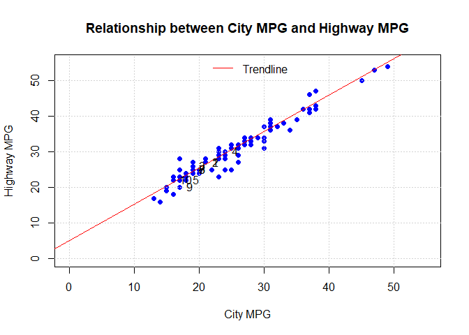<!-- -->

### (f) Show the distribution of cars by bodyStyle.

``` r
# Count the number of cars by bodyStyle
bodyStyle_counts <- table(carIns_final$bodyStyle)

# Create a bar plot
barplot(bodyStyle_counts, 
        xlab = "Body Style",
        ylab = "Number of Cars",
        main = "Distribution of Cars by Body Style",
        col = "blue")
```

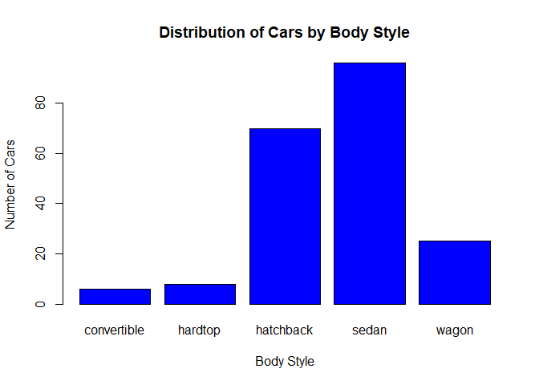<!-- -->

### (g) Show the distribution of cars by price. Suggestion: create bins of width equal to 5000.

``` r
# Calcular los límites de los intervalos
min_price <- min(carIns_final$price)
max_price <- max(carIns_final$price)
interval_width <- 5000
breaks <- seq(min_price, max_price + interval_width, by = interval_width)

# Crear el gráfico de histograma
hist(carIns_final$price, 
     breaks = breaks,
     xlab = "Precio",
     ylab = "Número de Autos",
     main = "Distribución de Autos por Precio",
     col = "blue")
```

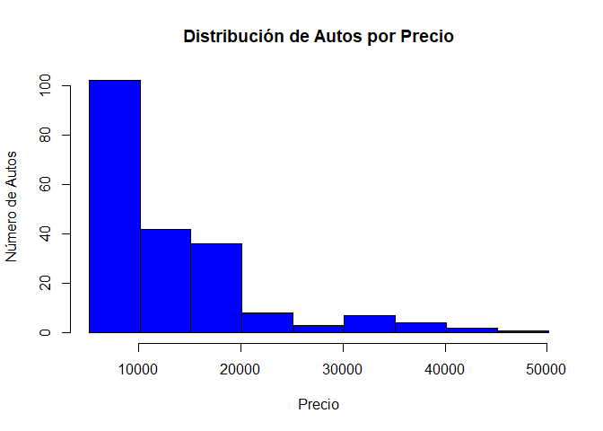<!-- -->

``` r
# USANDO GGPLOT2
# Crear los bins
interval_width <- 5000
breaks <- seq(min(carIns_final$price), max(carIns_final$price) + interval_width, by = interval_width)

# Crear el histograma usando ggplot2

ggplot(carIns_final, aes(x = price)) +
  
  geom_histogram(breaks = breaks, fill = "blue", color = "black") +
  
  labs(x = "Precio", y = "Numero de Carros",
       title = "Distribución de Autos por Precio") +
  theme_minimal()
```

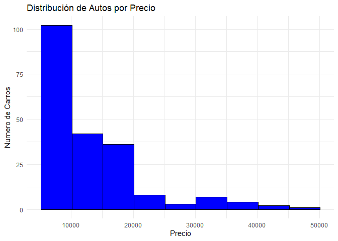<!-- -->

### (h) Add the information of the density estimation to the previous graph.

``` r
# Crear los bins
interval_width <- 5000
breaks <- seq(min(carIns_final$price), max(carIns_final$price) + interval_width, by = interval_width)

# Crear el histograma usando ggplot2

ggplot(carIns_final, aes(x = price)) +
  #geom_histogram(breaks = breaks, fill = "blue", color = "black", alpha = 0.5) +
  geom_density(color = "green", size = 3) +
    stat_density(geom = "line", color = "red", size = 1) +

  labs(x = "Precio", y = "Numero de Carros",
       title = "Distribución de Autos por Precio") +
  theme_minimal()
```

    ## Warning: Using `size` aesthetic for lines was deprecated in ggplot2 3.4.0.
    ## ℹ Please use `linewidth` instead.
    ## This warning is displayed once every 8 hours.
    ## Call `lifecycle::last_lifecycle_warnings()` to see where this warning was
    ## generated.

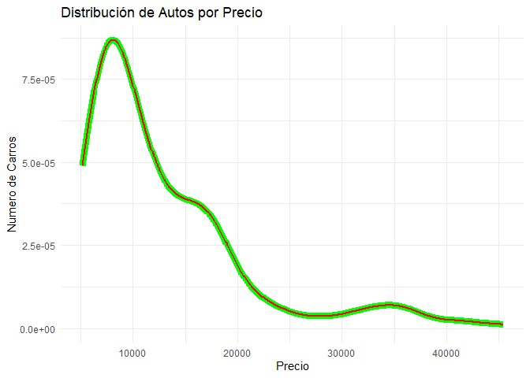<!-- -->

### (i) Check (visually) if it is plausible to consider that price follows a normal distribution.

``` r
ggplot(carIns_final, aes(x = price)) +
  geom_density(fill = "blue", alpha = 0.5) +
  labs(x = "Precio", y = "Densidad",
       title = "Distribución de Precios de Autos") +
  theme_minimal()
```

<!-- -->

``` r
# Create Q-Q plot
# Crear el gráfico Q-Q utilizando qqnorm y qqline
qqnorm(carIns_final$price, main = "Gráfico Q-Q de Price", xlab = "Cuantiles teóricos", ylab = "Cuantiles observados")
qqline(carIns_final$price, col = "red")
```

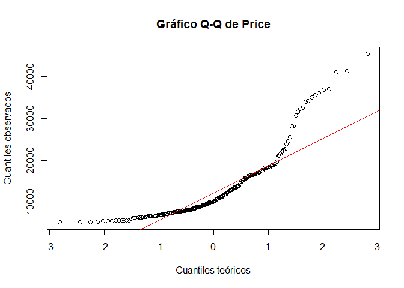<!-- -->

``` r
# Calcular los límites de los intervalos
min_price <- min(carIns_final$price)
max_price <- max(carIns_final$price)
interval_width <- 5000
breaks <- seq(min_price, max_price + interval_width, by = interval_width)

# Crear los cuantiles teóricos y observados
quantiles_teoricos <- qnorm(ppoints(length(carIns_final$price)))
quantiles_observados <- quantile(carIns_final$price, probs = ppoints(length(carIns_final$price)))

# Crear el gráfico QQ utilizando ggplot2
library(ggplot2)

qq_data <- data.frame(QuantilesTeoricos = quantiles_teoricos, QuantilesObservados = quantiles_observados)

ggplot(qq_data, aes(x = QuantilesTeoricos, y = QuantilesObservados)) +
  geom_point(color = "blue") +
  geom_abline(slope = 1, intercept = 0, color = "red", linetype = "dashed") +
  labs(x = "Cuantiles Teóricos", y = "Cuantiles Observados",
       title = "Gráfico QQ de carIns_final$price") +
  theme_minimal()
```

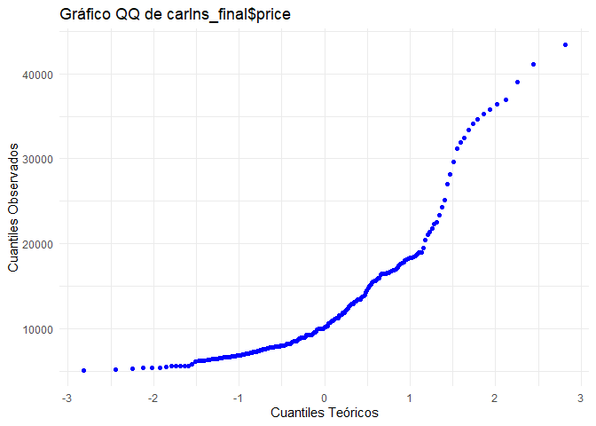<!-- -->

#### La distribución de los precios no sigue una distribucion normal

### (j) Show the distribution of price by make attribute. Suggestion: use boxplots and the function coord_flip().

``` r
# Crear el gráfico de boxplots de la distribución de precios por atributo "make" con ggplot2


ggplot(carIns_final, aes(x = make, y = price)) +
  geom_boxplot(fill = "blue", color = "black", alpha = 0.5) +
  coord_flip() +
  labs(x = "Marca", y = "Precio",
       title = "Distribución de Precio por Marca") +
  theme_minimal()
```

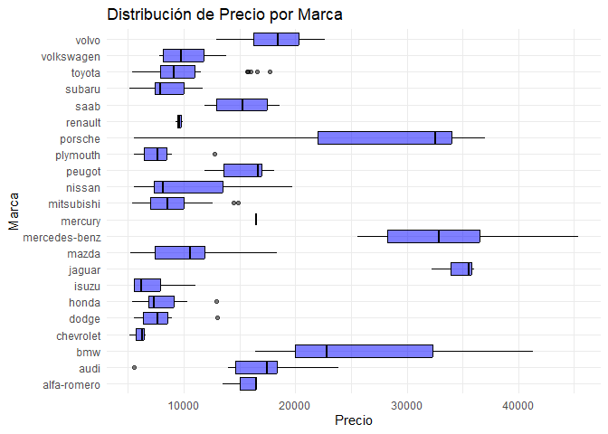<!-- -->

### (k) Show the distribution of price by nDoors attribute. Suggestion: use histograms

``` r
ggplot(carIns_final, aes(x = price, fill = nDoors)) +
  geom_histogram(binwidth = 5000, color = "black", alpha = 0.5) +
  labs(x = "Precio", y = "Número de Autos",
       title = "Distribución de Precio por Número de Puertas") +
  scale_fill_discrete(name = "Número de Puertas") +
  theme_minimal()
```

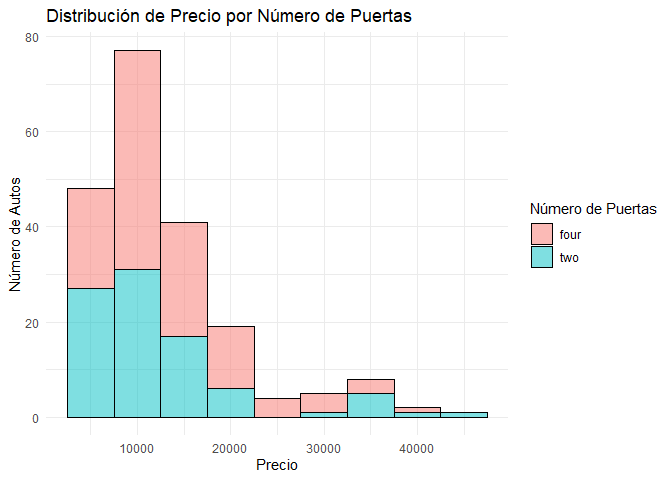<!-- -->

### (l) Show the distribution of price by bodyStyle and nDoors attributes. Suggestion: use histograms.

``` r
ggplot(carIns_final, aes(x = price, fill = nDoors)) +
  geom_histogram(binwidth = 5000, position = "dodge", color = "black", alpha = 0.5) +
  facet_wrap(~ bodyStyle, nrow = 1) +
  labs(x = "Precio", y = "Número de Autos",
       title = "Distribución de Precio por Estilo de Carrocería y Número de Puertas") +
  scale_fill_discrete(name = "Número de puertas") +
  theme_minimal()
```

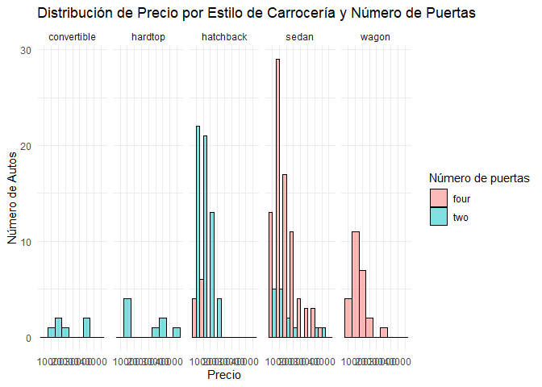<!-- -->

``` r
ggplot(carIns_final, aes(x = price)) +
  geom_histogram(binwidth = 5000, fill = "blue", color = "black", alpha = 0.5) +
  facet_grid(bodyStyle ~ nDoors) +
  labs(x = "Precio", y = "Número de Autos",
       title = "Distribución de Precio por Estilo de Carrocería y Número de Puertas") +
  theme_minimal()
```

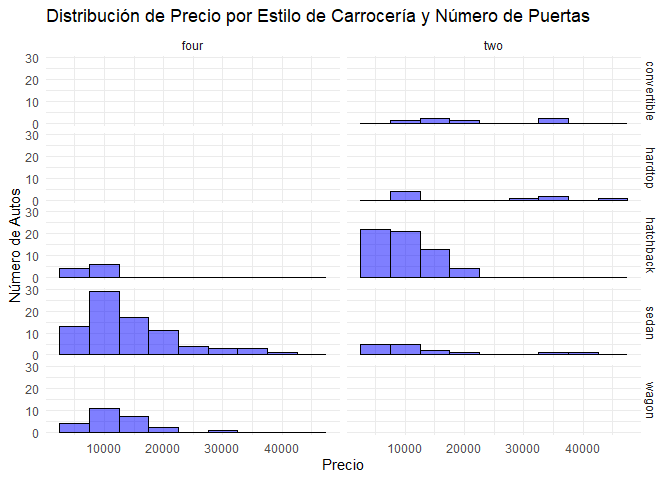<!-- -->

### (m) Add the parameter scales=“free_y” to the facet function in the previous graph.

``` r
ggplot(carIns_final, aes(x = price, fill = nDoors)) +
  geom_histogram(binwidth = 5000, position = "dodge", color = "black", alpha = 0.5) +
  facet_wrap(~ bodyStyle, nrow = 1, scales = "free_y") +
  labs(x = "Precio", y = "Número de Autos",
       title = "Distribución de Precio por Estilo de Carrocería y Número de Puertas") +
  scale_fill_discrete(name = "Número de puertas") +
  theme_minimal()
```

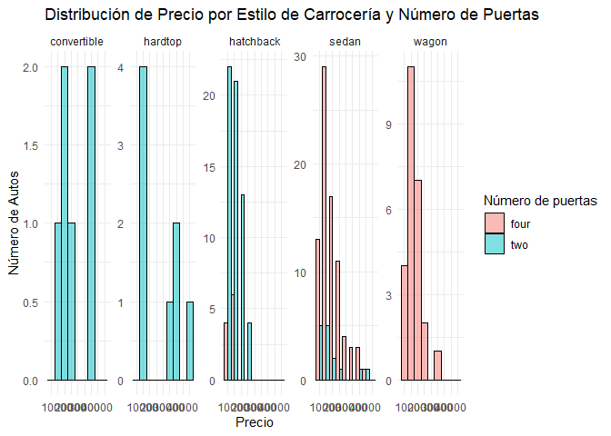<!-- -->

``` r
ggplot(carIns_final, aes(x = price)) +
  geom_histogram(binwidth = 5000, fill = "blue", color = "black", alpha = 0.5) +
  facet_grid(bodyStyle ~ nDoors, scales = "free_y") +
  labs(x = "Precio", y = "Número de Autos",
       title = "Distribución de Precio por Estilo de Carrocería y Número de Puertas") +
  theme_minimal()
```

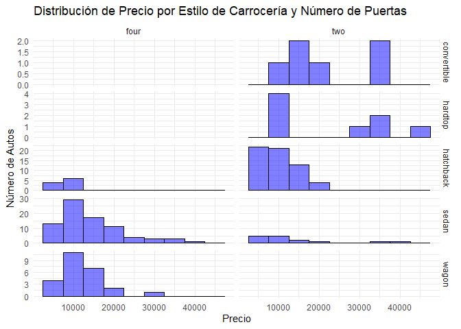<!-- -->
